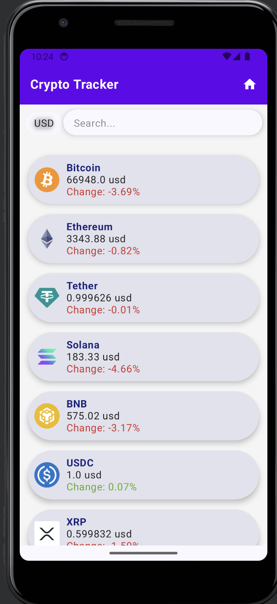
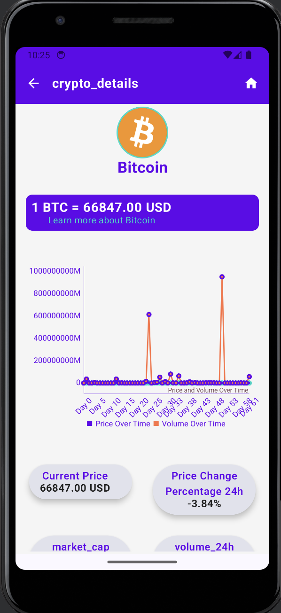
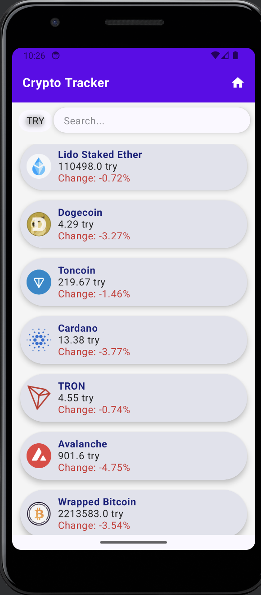
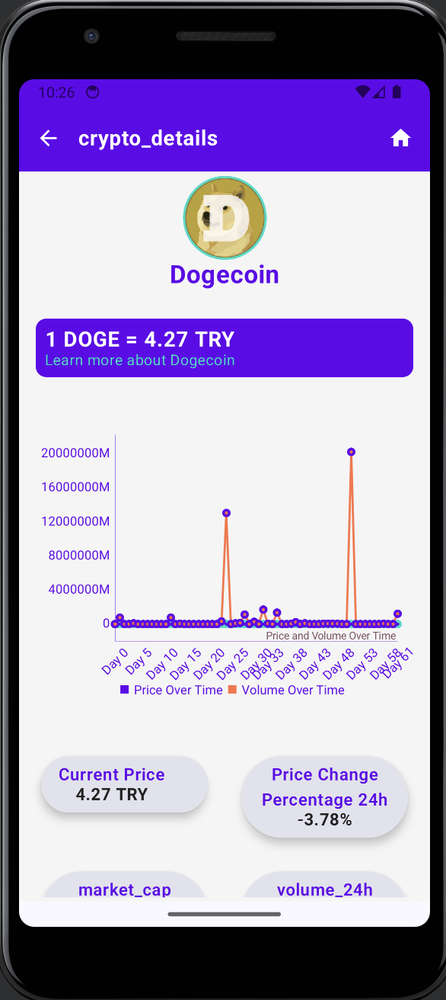

# Crypto Tracker

Crypto Tracker is an Android application designed to track and display real-time information about various cryptocurrencies. The app allows users to view current prices, price changes, market caps, volume, and more for different cryptocurrencies. Users can also switch between multiple currencies to see the equivalent values. Crypto Tracker is an Android application built using Jetpack Compose that allows users to track cryptocurrency prices, view detailed information about each cryptocurrency, and switch between different currencies (e.g., USD, TRY).

## Key Features

1. **Real-Time Cryptocurrency Data:**
    - Fetches up-to-date cryptocurrency data from the CoinGecko API.
    - Displays current prices, price changes, market caps, volume, circulating supply, max supply, ATH (All-Time High), and ATL (All-Time Low).

2. **Currency Selection:**
    - Supports multiple currencies (e.g., USD, EUR, TRY) for dynamic price conversion.
    - Allows users to switch between currencies using a dropdown menu.

3. **Search Functionality:**
    - Provides a search bar to quickly find specific cryptocurrencies.
    - Users can search for a specific cryptocurrency by name.
    - Filters the list of cryptocurrencies based on user input.

4. **Detailed Cryptocurrency View:**
    - Provides detailed information about a selected cryptocurrency, including price, market cap, volume, and historical price and volume charts.
    - Charts display price and volume trends over time with labeled axes.

5. **Composable Architecture:**
    - Follows a composable architecture similar to Flutter, enhancing code reusability and readability.
    - Utilizes Jetpack Compose for UI components.

6. **Cryptocurrency List:**
    - Displays a list of cryptocurrencies with their current prices and percentage change.

## Technologies Used

- **Kotlin:** Primary programming language for the application.
- **Jetpack Compose:** Used for building UI components declaratively.
- **Dagger-Hilt:** Dependency injection framework for managing dependencies.
- **Retrofit:** HTTP client for making API calls to the CoinGecko API.
- **MPAndroidChart:** Charting library for displaying price and volume trends.
- **Coil:** Image loading library for loading cryptocurrency logos.

## Code Structure

- **MainActivity:** Sets up the navigation graph and applies the app theme.
- **ViewModels:** Manages UI-related data in a lifecycle-conscious way.
- **Repository:** Handles data operations and abstracts the data sources.
- **UI Components:** Custom composable functions for reusable UI elements.
- **Extensions:** Provides extension functions for various utilities.

## Custom Extensions and Utilities

- **CustomCard:** A reusable card component for displaying information with consistent styling.
- **CustomText:** A customizable text component with default styling options.
- **VerticalSpacer & HorizontalSpacer:** Components for adding vertical and horizontal spaces between UI elements.
- **BaseScaffold:** A scaffold component with a customizable top app bar.
- **AppPadding:** Object containing predefined padding values for consistency.

## Screenshots


*Crypto List Screen with currency selection and search functionality.*


*Crypto Detail Screen displaying detailed information about a selected cryptocurrency.*


*Crypto List Screen showing prices in TRY currency.*


*Crypto Detail Screen displaying detailed information about Dogecoin.*

## Future Improvements

- **Authentication:** Add user authentication for a more personalized experience.
- **Favorites:** Allow users to mark cryptocurrencies as favorites for quick access.
- **Notifications:** Implement price alerts to notify users of significant price changes.
- **Additional Charts:** Provide more detailed charts for better data visualization.

## Architecture

The project follows the MVVM (Model-View-ViewModel) architecture pattern to separate concerns and improve testability and maintainability.

### Directory Structure
 ```
.
├── data
│   ├── api
│   │   └── CoinGeckoApiService.kt
│   ├── model
│   │   └── CryptoCurrencyItem.kt
│   └── repository
│       └── CryptoRepository.kt
├── di
│   └── AppModule.kt
├── ui
│   ├── theme
│   │   ├── Color.kt
│   │   ├── Theme.kt
│   │   └── Type.kt
│   └── view
│       ├── CryptoDetailContent.kt
│       ├── CryptoDetailScreen.kt
│       ├── CryptoListScreen.kt
│       └── components
│           ├── CustomBox.kt
│           ├── CustomCard.kt
│           ├── CustomSpacer.kt
│           └── CustomText.kt
├── util
│   ├── AppConstants.kt
│   └── extensions
│       └── GeneralCustoms.kt
└── viewmodel
├── CryptoDetailViewModel.kt
└── CryptoListViewModel.kt
 ```
### Key Components

- **CoinGeckoApiService.kt**: Defines the API endpoints and methods for fetching cryptocurrency data from CoinGecko.
- **CryptoRepository.kt**: Contains methods to fetch data from the API and handle data transformation.
- **CryptoListViewModel.kt**: Manages the state for the cryptocurrency list screen.
- **CryptoDetailViewModel.kt**: Manages the state for the cryptocurrency detail screen.
- **CustomBox.kt, CustomCard.kt, CustomSpacer.kt, CustomText.kt**: Custom composables for consistent UI design.

## How to Run

1. **Clone the repository:**
   ```sh
   git clone https://github.com/ezgifistikcioglu/CryptoTracker.git
   ```

2. **Open the project in Android Studio.**

3. **Build and Run:**
   - Ensure you have a valid internet connection for fetching real-time data from the API.
   - Build the project and run it on an emulator or a physical device.
